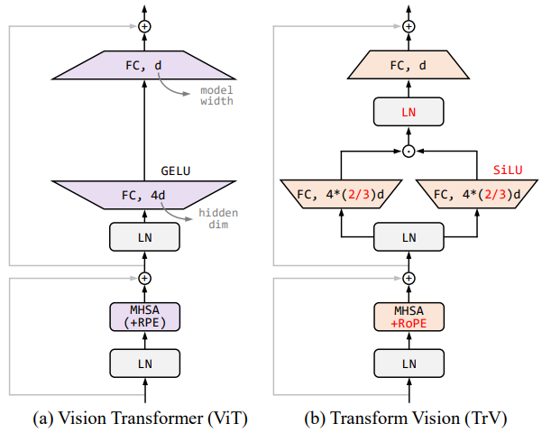
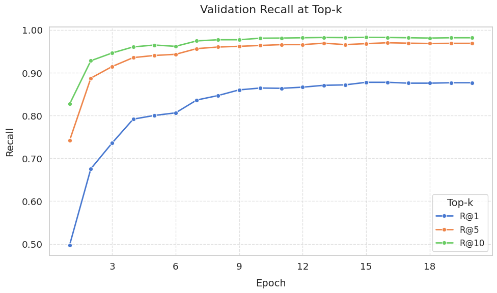

# tag-clip
This project is about a CLIP model trained with images and tags.
And I referenced a lot [open_clip](https://github.com/mlfoundations/open_clip/).

## CLIP-Approach


## Model
I used eva02_base_patch16_clip_224.merged2b_s8b_b131k model and pretrain weight. [EVA-02](https://arxiv.org/abs/2303.11331) [EVA-CLIP](https://arxiv.org/abs/2303.15389).  


## Usage
I recommend create conda env with python 3.10.
```
conda create -n tag_clip python=3.10
```

Install [torch](https://pytorch.org/get-started/previous-versions/)(v2.1.2), [open_clip](https://github.com/mlfoundations/open_clip/) and requirements.
```
pip install -r requirements.txt
```

### Model inference
```
python src/inference_example.py
```

### Model train 
You can preprocess the tag with `tag_process.py` before training. Just make sure the image and tag are in the same directory with the same name. In this process `..._processed.parquet` is created and you can use this for training. 
```
python src/tag_process.py --image_dir="path/to/image/and/text"
# or
python src/tag_process.py --config="config/tag_process.toml"to match your data.
```

Run `src/eva_clip.py` for training. You can easily set arguments with a config file.  
In the config file, change the `train`, `image_key`, `tag_key` arguments to match your dataset.  
For a detailed description of the arguments, check out `src/utils/params.py.`  

Optionally, install [faiss](https://github.com/facebookresearch/faiss/blob/main/INSTALL.md) to calculate the recall of the validation. This corresponds to the `recall` argument of config file.
```
python src/eva_clip.py --config_path="config/eva02_base_patch16_clip_default.toml"
```

## Evaluate
train: 29187, valid:3000   
  
Epoch15
- R@1: 0.87733
- R@5: 0.96767
- R@10: 0.98233


