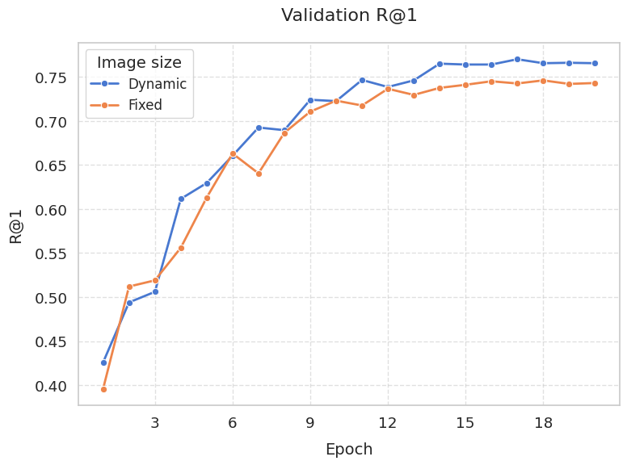
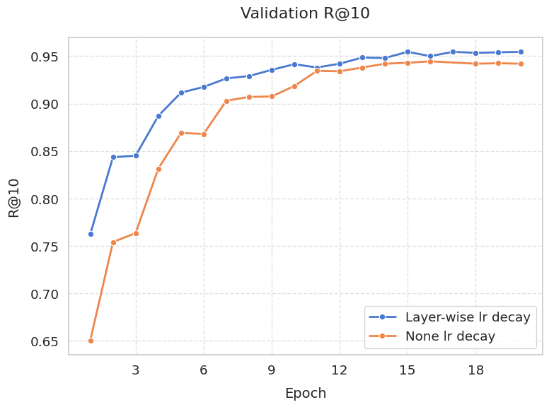

# Expriments
**Dataset for expriments**  
Model: eva02_base_patch16_clip  
Train: 8000  
Valid: 2000  

## ClipLoss(CE) VS TagClipLoss(KL)
**ClipLoss** only focuses on the relevance between correct image-text pairs in similarity matrix.  
**TagClipLoss** considers the degree of tag match rate even for negative pairs in similarity matrix.  

 

## Fixed image size VS Dynamic image size
**Fixed image size**: Add padding to images with non-1 aspect ratios to make the aspect ratio 1, and resized to 448x448.  
**Dynamic image size**: The images are divided into patch_size(16), with a pixel size of no larger than 448x448.

 

## Layer-wise lr decay
**Layer-wise lr decay** is a method that applies a lower lr to deeper layer.  
Deeper layers focus on more complex and abstract features, so they can be trained more slowly.  
And also It useful to fine-tune model while keep pre-trained knowledge.  

 

## Noraml shuffle VS Weighted shuffle
**Noraml shuffle**: Randomly shuffles the order of tags and truncates tags to fit the context_length.  
**Weighted shuffle**: Using the probability density function of a normal distribution, select tags based on their frequency and truncate them to fit the context_length.

 
   

The intention was to select less frequent tags more often, as they have a relatively small chance of being selected, but this actually reduced performance.
